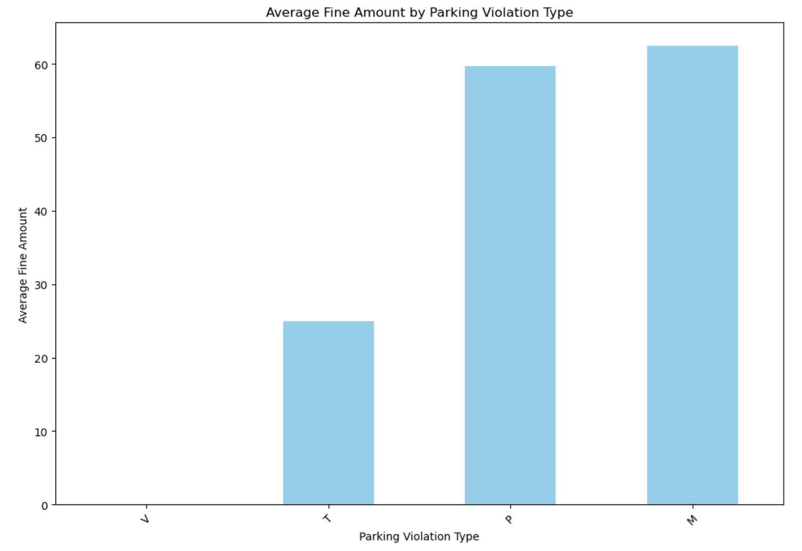
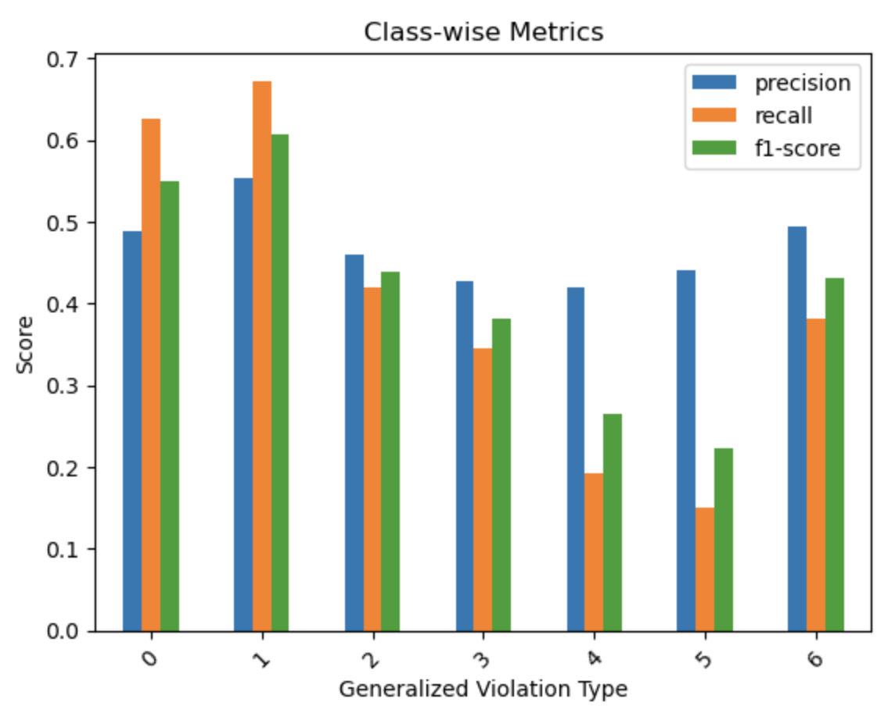
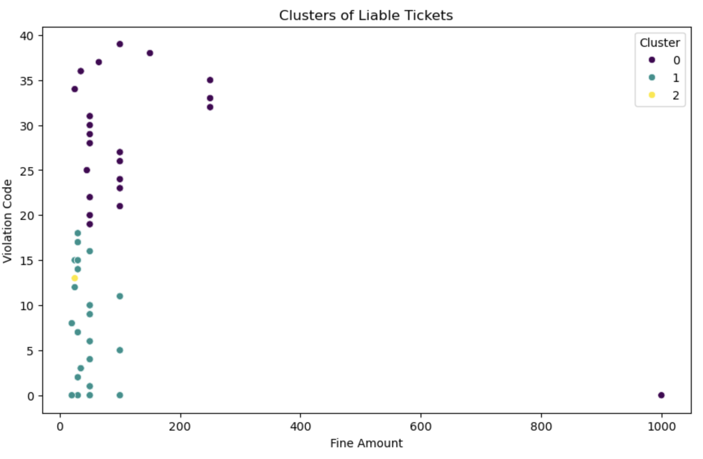
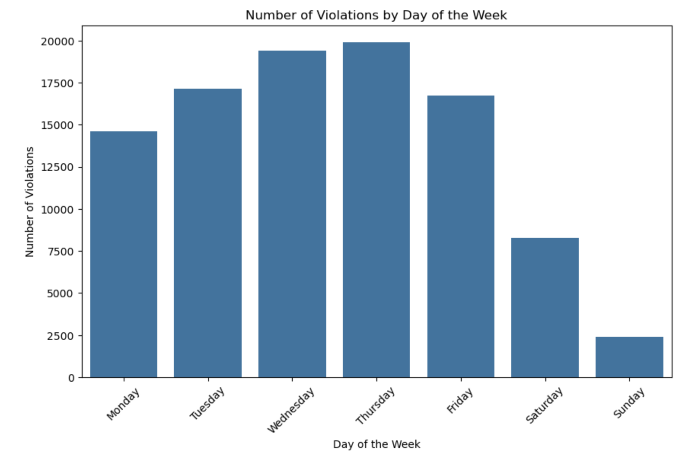

# Parking Violations Modeling

## Project Overview
This project explores parking violations in Washington, D.C., by analyzing data to model violation types across various factors such as time, location, issuing agency, and vehicle type. The project aims to uncover patterns in violation types and lay the groundwork for predictive modeling, with potential future applications in revenue forecasting and enforcement optimization.

## Description
Using the detailed parking violation dataset from Washington, D.C., we aimed to model and classify parking violations, focusing on key variables such as violation type, issuing agency, time of issuance, and location. Given the unique landscape of Washington, D.C., with numerous federal and local agencies involved in ticketing, this dataset provides a rich context for understanding parking behaviors. Our analysis includes data preprocessing, feature engineering, and the application of machine learning models to explore and classify parking violation types effectively.

## Table of Contents
1. [Data](#data)
2. [Processing](#processing)
3. [Models](#models)
4. [Results](#results)
5. [App](#app)
6. [Conclusions](#conclusions)
7. [Bonus](#bonus)
8. [Resources](#resources)

## Data
The dataset includes several key fields:

- **Violation Type and Code:** Detailed categories of violations, including various parking, taxi, and other codes.
- **Issuing Agency:** Federal and local agencies involved in issuing tickets, such as D.C. Metropolitan Police and the Department of Public Works.
- **Location Data:** Available through street addresses, latitude/longitude, MAR IDs, and Maryland State Plane coordinates.
- **Time and Date:** Detailed issuance times, used to derive meaningful time periods and patterns.
- **License Plate State:** Indicating whether the vehicle is from out-of-state or local.

This data provided the foundation for our analyses, allowing us to explore temporal, spatial, and categorical distributions of parking violations.

## Processing
Our data processing involved the following steps:

1. **Data Cleaning:** Dropped irrelevant columns and addressed missing values.
2. **Feature Engineering:** Created new features to enhance model inputs:
   - Violation Code Aggregation: Combined less common violation codes into an “Other” category to improve model performance.
   - Issuing Agency Aggregation: Grouped agencies that infrequently issued tickets.
   - Time Period Creation: Converted raw time into defined periods (e.g., morning, afternoon, evening) to better capture behavioral patterns.
   - Weekend Indicator: Added a Boolean field to indicate whether the ticket was issued on a weekend or a weekday.
   - Out-of-State Indicator: Created a field to mark out-of-state vehicles.
   - Location Standardization: Mapped latitude/longitude to specific D.C. neighborhoods using geoJSON polygons, enhancing spatial analysis.

## Models
Several machine learning models were applied to classify and predict ticket characteristics:

- **Initial Random Forest Model:** Attempted to classify tickets by violation type, with a focus on precision and recall across parking, taxi, and other categories.
- **Improved Random Forest Model:** Applied after aggregating rare codes and standardizing time periods, resulting in enhanced predictive accuracy.
- **Clustering for Ticket Analysis:** Used K-means clustering to identify patterns among violation codes and fine amounts, resulting in three distinct clusters for focused insights.

Each model was fine-tuned, tested, and evaluated based on classification accuracy and interpretability, providing insights into key factors driving ticket issuance.

## Results
Key findings include:

- **Violation Type Distribution:** The most common parking violations were effectively classified, but less frequent types required aggregation for accurate predictions.
- **Out-of-State Ticket Patterns:** Out-of-state vehicles were linked to certain violation types and locations, especially in high-traffic and tourist areas.
- **Neighborhood Analysis:** Grouping violations by neighborhoods provided insights into specific areas with high ticketing activity, which could guide enforcement strategies.

### Visualizations:
1. Parking Violation Types and Counts: 
2. Class-wise Metrics: 
3. Clusters of Liable Tickets: 
4. Number of Violations by Day of the Week: 

## App
An interactive web app was developed to display key findings and allow users to explore the data and model results. Users can filter by violation type, location, time of issuance, and other variables, providing a hands-on experience with the analysis.

[Project Slides](https://docs.google.com/presentation/d/1lSg_DYLqdUP4QHRnzCyxQoRfXhO9BwwHW393YDqar4c/edit#slide=id.g54dda1946d_6_308)

## Conclusions
The project demonstrates that parking violations can be effectively categorized and analyzed using machine learning techniques, with strong potential for applications in enforcement planning and revenue forecasting. Key takeaways include:

- Certain violation types and issuing agencies contribute disproportionately to total tickets.
- Temporal and spatial patterns in ticketing are evident and could inform optimized enforcement schedules.
- The clustering of violation codes by fine amount provides a framework for prioritizing enforcement efforts based on revenue potential.

## Bonus
Future work could enhance this project in several directions:

- **Revenue Prediction Models:** Build on violation type distributions and fine amounts to create revenue forecasting models, aiding budget planning for D.C.’s parking enforcement agencies.
- **Targeted Awareness Campaigns:** Leverage out-of-state violation insights to develop campaigns aimed at visitors, reducing non-compliance and repeat offenses.
- **Enhanced Temporal Analysis:** With additional time data, conduct a deeper time series analysis to optimize enforcement timing, particularly around known high-traffic events or days.

## Collaborators
- Niaz Azar
- Rajamani Muthuraman
- Aysenur Teyfur
- Kevin Zhou

## Resources
- **Data Source**: [Washington, D.C. parking violations data](https://catalog.data.gov/dataset/parking-violations-issued-in-september-2024)
- **Libraries Used**:
  - Python: Pandas, scikit-learn, Matplotlib, Seaborn, joblib.
  - Geospatial Analysis: geoJSON, geopandas for neighborhood mapping.
- **Tools**: Jupyter Notebook, Google Colab, GitHub, and an interactive app for exploration.
- **Additional Resources**: [D.C. Open Data Portal for additional contextual data](https://opendata.dc.gov/)

